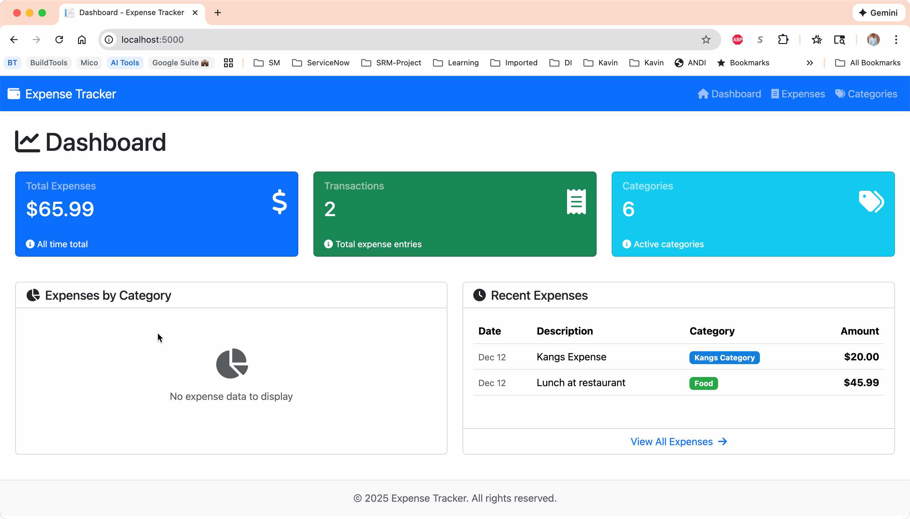
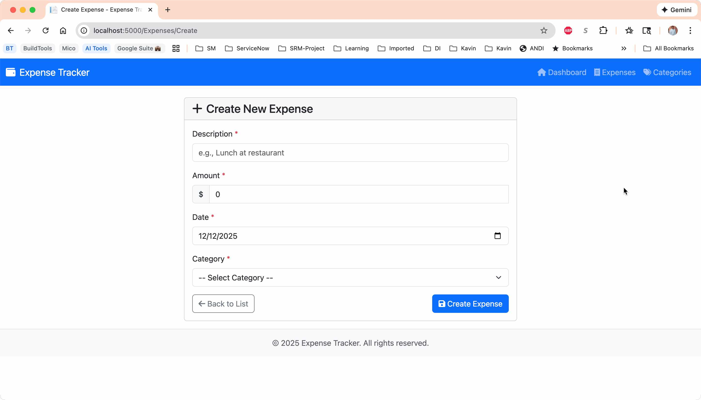
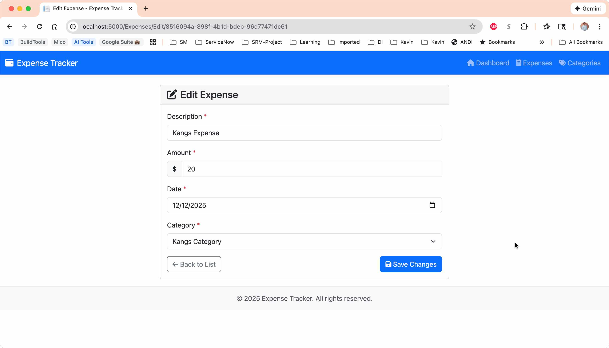
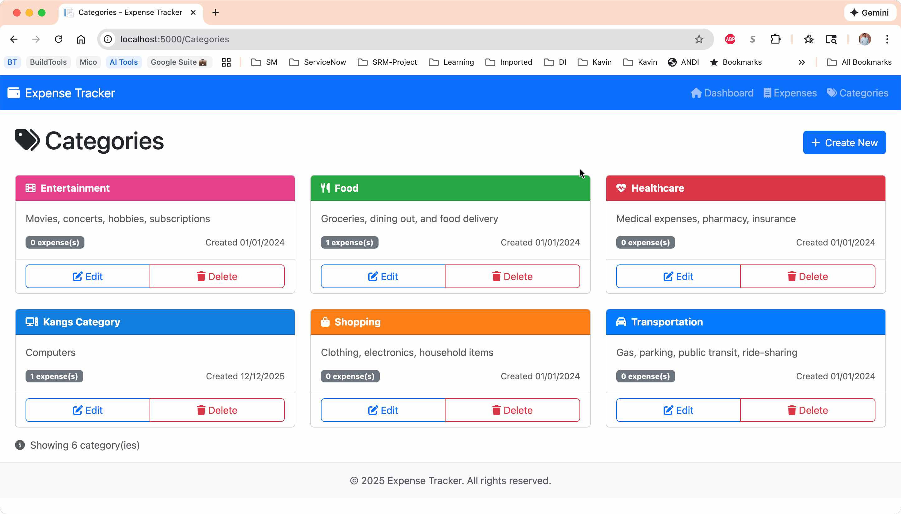
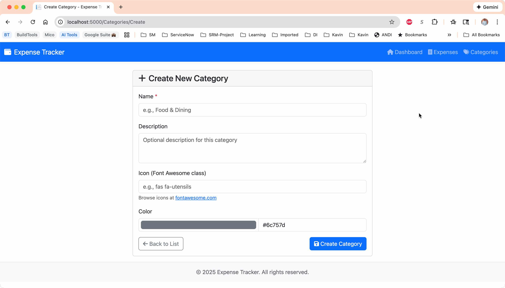

# 💰 Personal Expense Tracker

A full-stack ASP.NET Core expense tracking application built with GitHub Copilot assistance. This project demonstrates modern .NET development patterns including Entity Framework Core, Razor Pages, REST APIs, and FluentValidation.

## 🚀 Features

- **Dashboard** - Visual overview with Chart.js pie charts and recent transactions
- **Expense Management** - Full CRUD operations for tracking expenses
- **Category Management** - Organize expenses with custom categories, icons, and colors
- **REST API** - Complete API with Swagger/OpenAPI documentation
- **Responsive UI** - Bootstrap 5 with modern, mobile-friendly design

## 🛠️ Tech Stack

| Layer | Technology |
|-------|------------|
| **Framework** | ASP.NET Core 10.0 |
| **Language** | C# 13 |
| **Database** | SQLite (EF Core 10) |
| **ORM** | Entity Framework Core |
| **Validation** | FluentValidation |
| **Frontend** | Razor Pages, Bootstrap 5.3, Chart.js 4.4 |
| **API Docs** | Swagger/OpenAPI |

## 📁 Project Structure

```
DotNet-Expense-Tracker/
├── src/
│   └── ExpenseTracker.Web/
│       ├── Controllers/Api/      # REST API controllers
│       ├── Data/                 # DbContext and migrations
│       ├── DTOs/                 # Data Transfer Objects
│       ├── Models/               # EF Core entities
│       ├── Pages/                # Razor Pages
│       │   ├── Categories/       # Category CRUD pages
│       │   ├── Expenses/         # Expense CRUD pages
│       │   └── Shared/           # Layout and partials
│       ├── Services/             # Business logic layer
│       ├── Validators/           # FluentValidation rules
│       └── wwwroot/              # Static files (CSS, JS)
├── dotnet-exercise/              # GitHub Copilot bootcamp materials
│   ├── 2-breakout/               # Step-by-step session guides
│   └── README.md                 # Exercise instructions
└── README.md                     # This file
```

## 🏃 Getting Started

### Prerequisites

- [.NET 10 SDK](https://dotnet.microsoft.com/download)
- [Entity Framework Core Tools](https://docs.microsoft.com/en-us/ef/core/cli/dotnet)

```bash
# Verify installation
dotnet --version
dotnet ef --version
```

### Installation

1. **Clone the repository**
   ```bash
   git clone https://github.com/yourusername/DotNet-Expense-Tracker.git
   cd DotNet-Expense-Tracker
   ```

2. **Navigate to the web project**
   ```bash
   cd src/ExpenseTracker.Web
   ```

3. **Restore dependencies**
   ```bash
   dotnet restore
   ```

4. **Apply database migrations**
   ```bash
   dotnet ef database update
   ```

5. **Run the application**
   ```bash
   dotnet run
   ```

6. **Open in browser**
   - Web UI: https://localhost:5001
   - Swagger API: https://localhost:5001/swagger

## 📊 API Endpoints

### Expenses
| Method | Endpoint | Description |
|--------|----------|-------------|
| GET | `/api/expenses` | Get all expenses |
| GET | `/api/expenses/{id}` | Get expense by ID |
| GET | `/api/expenses/total` | Get total expenses amount |
| GET | `/api/expenses/by-category` | Get expenses grouped by category |
| POST | `/api/expenses` | Create new expense |
| PUT | `/api/expenses/{id}` | Update expense |
| DELETE | `/api/expenses/{id}` | Delete expense |

### Categories
| Method | Endpoint | Description |
|--------|----------|-------------|
| GET | `/api/categories` | Get all categories |
| GET | `/api/categories/{id}` | Get category by ID |
| POST | `/api/categories` | Create new category |
| PUT | `/api/categories/{id}` | Update category |
| DELETE | `/api/categories/{id}` | Delete category |

## 🎓 GitHub Copilot Bootcamp

This project includes hands-on exercise materials for learning GitHub Copilot with .NET development:

```
dotnet-exercise/2-breakout/
├── 1-Day1-Session1-Models-DbContext.md      # EF Core entities & database
├── 2-Day1-Session2-Services-Business-Logic.md # Services & validation
├── 3-Day1-Session3-REST-APIs-Controllers.md   # API development
└── 4-Day1-Session4-Web-Interface-Razor.md     # Razor Pages UI
```

Each session includes:
- Step-by-step Copilot prompts using `/generate`
- Expected code examples for verification
- Copilot tips and best practices

## 📸 Screenshots

### Dashboard
Summary cards showing total expenses, transaction count, and categories with pie chart visualization.



### Expense Management

**Expenses List** - Sortable expense list with category badges.


**Create Expense** - Add new expenses with validation.



**Edit Expense** - Modify existing expenses.



### Category Management

**Categories List** - Card-based category grid with custom colors and icons.



**Create Category** - Add new categories with color picker and icon support.



## 🧪 Database

The application uses SQLite with seed data including 5 default categories:
- 🍽️ Food (Green)
- 🚗 Transportation (Blue)
- 🎬 Entertainment (Pink)
- 🛍️ Shopping (Orange)
- 💊 Healthcare (Red)

## 📝 License

This project is licensed under the [MIT License](LICENSE).

## 🤝 Contributing

1. Fork the repository
2. Create a feature branch (`git checkout -b feature/amazing-feature`)
3. Commit your changes (`git commit -m 'Add amazing feature'`)
4. Push to the branch (`git push origin feature/amazing-feature`)
5. Open a Pull Request

---

Built with ❤️ and GitHub Copilot
